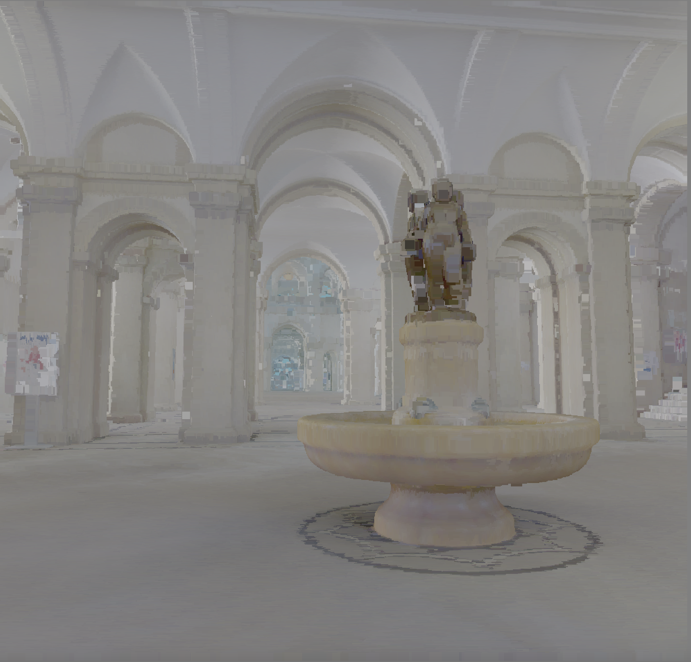

# Build Instructions

## 1. Install environment
- C++ Build tool CMAKE - https://cmake.org/
- Vulkan SDK - https://vulkan.lunarg.com/

## 2. Clone repository and dependencies
```
git clone https://github.com/CompilerLuke/eth_localization.git --recursive
```

## 3. Build using cmake
```
cd eth_localization
mkdir build
cd build
cmake ../ -DCMAKE_BUILD_TYPE=RelWithDebInfo
make -j 8
cd ../data
curl https://polybox.ethz.ch/index.php/s/FkRiq4m1131wWxI/download > pointcloud.pc 
```

# Run 
Run `../build/viz/eth_localization_viz_app` from within the data directory

# example



